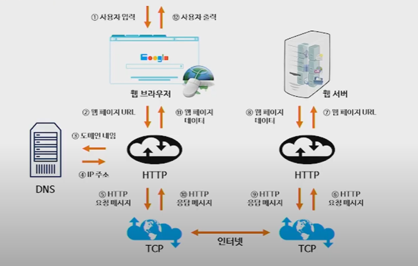
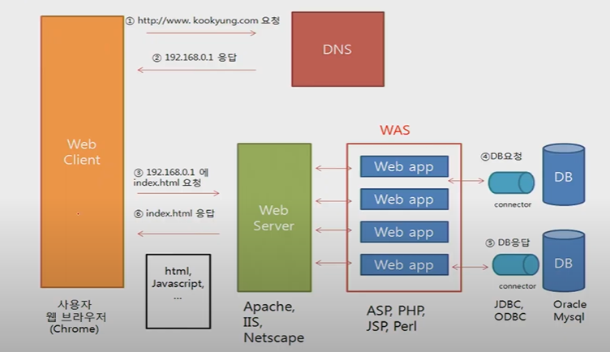
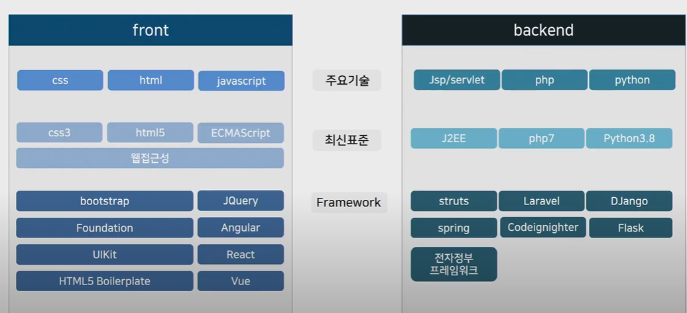
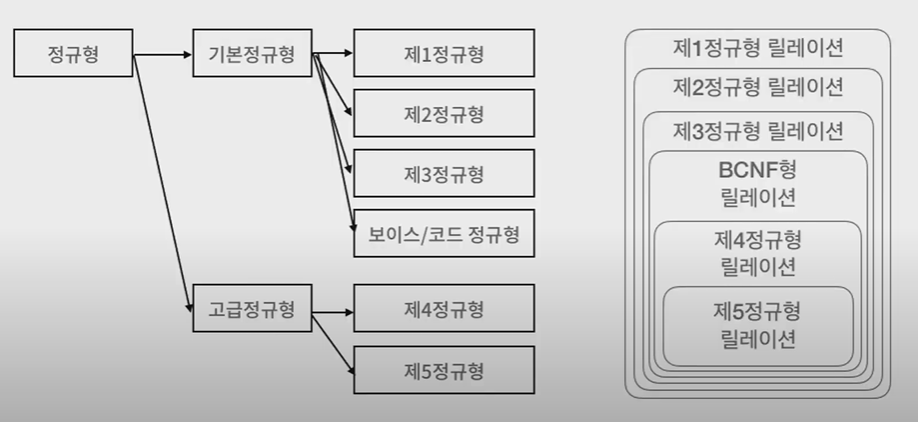
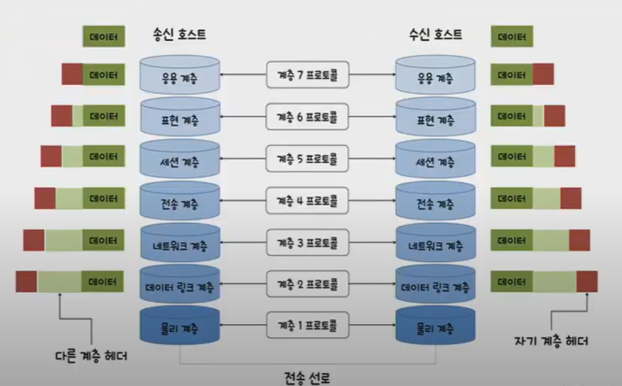
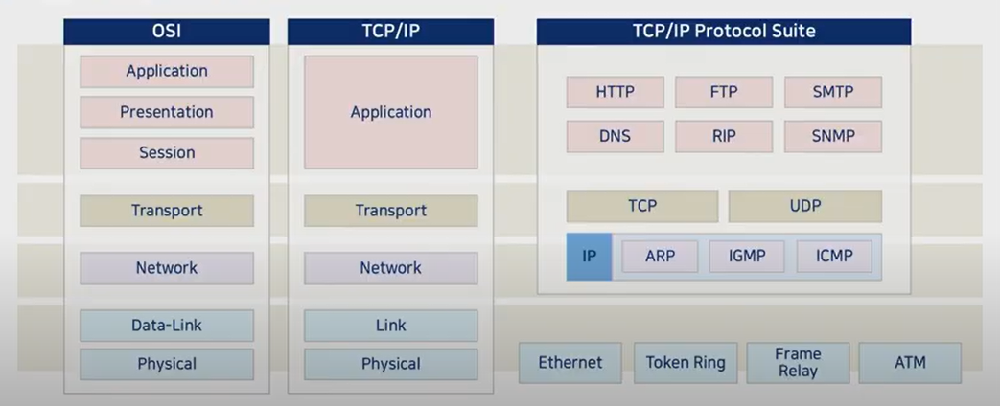
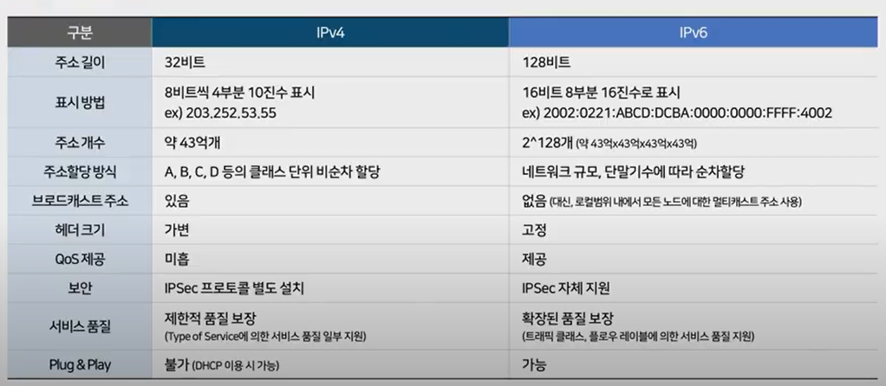

# CS 기초

> 2020/09/24 Computer Science

## SW 개발자에게 요구되는것은?

- 개발 경험은 필수인가?
  - 빨리 배우고, 협업할 수 있게 소통이 잘 되고, 자기 생각을 논리적으로 이야기 할 수 있는 사람이 필요함.
- 언어는 여러 개? or 한 개?
  - 새로운 언어를 가르쳐도 잘 배운다는 것을 어필해야함.
- 포트폴리오 서류에서 기초 역량을 어떻게 강조해야 하는지?
  - 프로젝트를 진행하면서 어떻게 발전해왔는지, 어떤 고민을 했는지 보여주는 것이 중요함.
  - 발전사가 잘 드러나는 의미 있는 커밋로그가 있으면 판단에 도움이 된다.

## SW 직무면접_기출문제

- 소프트웨어 위기에 대해서 설명하시오.
- 소프트웨어 공학이 필요한 이유는?
- 소프트웨어 개발 경험과 소프트웨어 개발 시 적용한 개발 방법론이 있다면 설명하시오.
  - 소프트웨어 개발의 경험을 생각해보면 1개 이상의 방법론이 적용된 것을 알 수 있습니다. 개발당시에 고려한 개발방법론이 없더라도 개발했던 경험을 복기해서 가장 적절한 개발방법론을 적용하면 됨.
- 소프트웨어 프로젝트 진행 경험에 대해서 설명하시오.
  - 소프트웨어 진행 경험은 무엇을 개발했다 보다는 어떻게 개발했다고 말하는 것이 중요함. 개발 방법론이나 소프트웨어 아키텍쳐를 언급하면서 설명.
- 자바와 c의 차이를 설명하시오.
  - 절차지향 vs 객체지향, 하드웨어 최적화 vs 하드웨어 독립적 등의 여러 관점에서 비교 설명합니다. 단순히 문법적 설명이 아니라 어떤 방면에서는 어떤 언어가 좋다라고 구체적으로 설명
- JVM 가비지컬렉션 동작 과정을 설명하시오.
  - 가비지 컬렉션은 메모리와 연관됨. 소프트웨어 개발 경험 중 메모리 부족현상을 겪은 경험이 있으면, 경험을 토대로 설명한다.
- JAVA에 적용된 OOP에 대해 설명하시오.
- 빅데이터 활용 방안에 대해서 설명하시오.
- 인공지능 기술은 회사의 사업에 적용해서 설명하시오.
- 실생활에서 볼 수 잇는 사물 인터넷 기술에 대해서 설명하시오.
- 리팩토링이란 무엇인지 설명하시오.
- 형상관리 활용 경험을 설명하시오.
  - 형상관리의 경험이 있다면 형상 관리의 경험을 이야기한다.
  - 만약 없다면 회사에서 제공하는 서비스나 소프트웨어를 대상으로 형상 관리의 필요성을 설명한다.
- AJAX가 무엇인지 예를 들어서 설명하시오.
  - AJAX는 회원가입시 아이디 중복검사나 비밀번호 유효성 검사 등에 사용합니다. 유사한 사례를 찾아서 설명
- 웹 브라우저 검색창에서 키워드를 입력하면 결과가 나오는 과정을 설명하시오.
  - 웹 서버의 흐름을 생각하고, 키워드를 입력 받아 웹 서버에서 처리해서 반환하는 과정을 도식화해서 설명함.

- View에 대해 설명하시오.
  - View 사용 경험을 예를 들어서 설명함.
- 인덱스에 대해 설명하시오.
  - 인덱스 사용경험을 예를 들어 설명함. 인덱스를 사용할 때와 사용하지 않을 때의 결과를 비교해서 설명함.
- No SQL이 갖는 장점을 설명하시오.
  - NoSQL은 빅데이터를 저장할 때 많이 사용함. NoSQL과 관계형 데이터베이스를 비교해서 설명함.
- 정규화와 비정규화에 대해서 설명하시오.
  - 정규화와 비정규화 작업의 경험이나, 사례를 들어 설명함.
- https://www.text.com 이라면 어떻게 동작하는지 설명하시오.
  - 네트워크 관점에서 동작을 설명함. 이 도메인을 IP 주소로 바꾸고 컴퓨터와 연결되어 있는 라우터를 통해 전달되고, 서버까지 전달되면 서버에서 다시 라우터를 통해 전달된다.
- IPv4와 IPv6에 대해서 비교 설명하시오.
  - 아래 비교 테이블과 같이 상세하게 비교하여 설명ㅎ

## 소프트웨어 개발 프로세스 정의

> 작업 순서의 집합 + 제약조건(일정,예산,자원)을 포함하는 일련의 활동

- 좁은 의미 : 사용자의 요구사항을 SW로 구현하기 위한 절차,과정\
- 넓은 의미 : 사용자의 목적을 이루기 위한 기획, 프로젝트 관리 등을 포함한 절차

- 애자일 프로세스 모델
  - 고객의 요구에 민첩하게 대응하고 그때그때 주어지는 문제를 풀어나가는 방법론
  - 프로세스와 도구 중심이 아닌, 개개인과의 상호 소통 중시
  - 문서 중심이 아닌, 실행 가능한 소프트웨어 중시

## 소프트웨어 아키텍처 정의

- 소프트웨어 아키텍처
  - 소프트웨어 전체적인 구조
  - 소프트웨어를 이루고 있는 여러 구성요소(서브시스템, 컴포넌트)
  - 구성 요소들의 인터페이스 간의 상호작용 정의
  - 시스템 설계와 개발 시 적용되는 원칙과 지침
- 소프트웨어 아키텍처의 구성
  - 구성요소
  - 구성 요소들 사이의 관계
  - 구성 요소들이 외부에 드러내는 속성
  - 구성 요소들과 주변 환경 사이의 관계
  - 구성 요소들이 제공하는 인터페이스
  - 구성 요소들의 협력 및 조립 방법
- 아키텍처 모델
  - 데이터 중심형 모델
    - 주요 데이터가 repository에서 중앙 관리
    - repository와 여기에 접근하는 서브시스템으로 구성
    - 데이터가 한 군데에 모여 있기 때문에 데이터를 일관성 있게 관리 가능
    - 새로운 서브시스템의 추가 용이
    - repository의 병목 현상 발생 가능
    - 서브시스템과 repository 사이의 강한 결합 - repository 변경 시 서브시스템에 영향을 줌
  - Client-Server 모델
    - 네트워크를 이용하는 분산 시스템 형태
    - 데이터와 처리 기능을 클라이언트와 서버에 분할하여 사용
    - 서버 :  클라이언트(서브시스템)에 서비스 제공
    - 클라이언트 : 서버가 제공하는 서비스를 요청하는 서브시스템
  - Layering 모델
    - 기능을 몇 개의 계층으로 나누어 배치
    - 구성 : 하위 계층은 서버, 상위 계층은 클라이언트 역할
  - Model/View/Controller 모델
    - 같은 모델의 서브시스템에 대하여 여러 뷰 서브시스템을 필요로 하는 시스템에 적합
    - 장점 : 디자인과 로직을 분리함으로써 느슨한 결합가능, 구조 변경 요청 시 수정 용이
    - 단점 : 기본 기능 설계로 인한 클래스 수의 증가로 복잡도 증가, 속도가 중요한 프로젝트에 부적합

## 프로그래밍 언어

> 절차지향 : 일련의 동작을 순서에 맞추어 단계적으로 실행하도록 명령어를 나열
>
> ​					데이터를 정의하는 방법보다는 명령어의 순서와 효율에 중점
>
> 객체지향 : 현실 세계를 객체 단위로 프로그래밍하여, 객체는 필드와 메서드를 묶어 표현
>
> ​					프로그램을 유연하고 변경이 용이하게 만들기 때문에 대규모 개발에서 사용
>
> ​					개발과 보수를 간편하게 하며, 보다 직관적인 코드 분석 가능

### 객체지향

- 캡슐화 : 필드와 메서드를 하나의 캡슐처럼 포장해 세부 내용을 외부에서 알 수 없도록 하는 것
- 상속 : 상위 객체를 상속받은 하위 객체가 상위 객체의 메서드와 필드를 사용하는 것.
- 다형성 : 대입되는 객체에 따라 메서드를 다르게 동작하도록 구현하는 기술, 실행 도중 동일한 이름의 다양한 구현체 중에서 메서드를 선택 가능

### JAVA

- JAVA의 목적
  - Write Once Run Anywhere
  - JAVA는 플랫폼에 독립적으로 동작
- JAVA 언어의 개발 목적
  - 프로그램 개발이 쉬워짐
  - 컴파일 환경이 아니라 interpreted환경이다
  - 한 개 이상의 thread를 사용할 수 있다
  - 동적으로 프로그램을 변화시킬 수 있다.
- JAVA Virtual Machine
  - JVM은 시스템마다 그리고 운영체제마다 다름
  - 자바 어플리케이션에서는 JDK 안에서 실행
  - 자바 컴파일러는 소슼포드를 JVM에 대한 머신코드 구조로 변환하면 JVM으로 구현된 development tool에 의해서 interpreted됨
- Garbage Collection
  - JAVA는 프로그래머에게 메모리를 release하게 하는 책임을 지우지 않음
  - 자동적으로 de-allocate하여 메모리의 부족 해결
- Process의 개념
  - 프로그램 : 저장장치에 저장되어 있는 정적인 상태
  - 프로세스 : 실행을 위해 메모리에 올라온 동적인 상태
  - 프로그램이 프로세스가 된다는 것은 운영체제로부터 프로세스 제어 블록을 얻는다는 뜻
  - 프로세스가 종료된다는 것은 해당 프로세스 제어 블록이 폐기된다는 뜻
- Thread의 개념
  - 프로세스에서 실행 제어만 분리한 실행 단위
  - 프로세서를 사용하는 기본 단위이며, 명령어를 독립적으로 실행할 수 있는 하나의 제어 흐름
  - 같은 그룹의 스레드는 코드, 주소 공간, 운영체제의 자원(파일, 신호) 등을 공유
- 멀티태스킹 : 운영체제가 CPU에 작업을 줄 때 시간을 잘게 나누어 배분하는 기법
- 멀티프로세싱 : CPU를 여러 개 사용하여 여러 개의 Thread를 동시에 처리하는 작업 환경
- CPU 멀티 Thread : 하드웨어적인 방법으로 하나의 CPU에서 여러 Thread를 동시에 처리하는 병렬 처리 기법
- 멀티 Thread : 운영체제가 소프트웨어적으로 프로세스를 작은 단위의 Thread로 분할하여 운영하는 기법

- 병행성 문제
  - 두 개 이상의 스레드가 어떤 객체에 있는 하나의 데이터에 접근하는 경우
  - 서로 다른 두 스택에서 실행되는 메소드가 객체에 있는 동일한 객체에 대한 getter 또는 setter 메소드를 호출하게 되는 경우
  - Thread는 자신이 잠시 중단된 적이 있다는 것을 기억할 수가 없음.
- Thread에서의 동기화
  - 다중 Thread 환경에서 한번에 하나의 Thread 만이 공유 데이터를 접근할 수 있도록 제어하는 것
  - 여러 Thread가 동시에 실행되는 다중 Thread에서 데이터를 공유하기 위해서는 어떤 Thread가 다른 Thread의 상태와 행동 등을 고려

## IoT

> 센서기술(Smart Sensor) : 스마트 센서는 기존의 센서가 발전하여 지능화된 센서, 측정 대물의 물리정보를 감지하는 일반 센서기술에 나노기술 또는  MEMS 기술을 접목하여 데이터 처리, 자동보정, 자가진단, 의사결정, 통신 등의 신호 처리 기능을 내장
>
> MEMS(Micro Electro Mechanical Systems) : 반도체 칩에 내장된 센서, 벨브 등과 같ㅇ른 아주 작은 기계장치와 컴퓨터를 결합하는 기술

## 형상관리

> SW개발 및 유지보수 과정에서 발생하는 변경 사항들을 관리하기 위해 개발된 일련의 활동\
>
> 소프트웨어 변경의 원인을 알아내고 제어하며 적절히 변경되고 있는지 확인하여 해당 담당자에게 통보하는 작업
>
> 형상관리는 소프트웨어 개발의 전 단계에 적용되는 활동으로, 유지보수 단계에서 수행
>
> 형상 관리는 소프트웨어 개발의 전체 비용을 줄이고, 개발 과정의 여러 방해 요인이 최소화되도록 보증하는 것을 그 목적으로 함.
>
> 

| SVN                            | GIT                                 |
| ------------------------------ | ----------------------------------- |
| 중앙 집중 모델                 | 분산 개발 모델                      |
| 소규모 시스템 적합             | 대규모 시스템 적합                  |
| 간단한 기능과 간단한 조작법    | 높은 오픈 소스 활용도와 다양한 기능 |
| branch merge 작업의 부담이 큼  | commit할 때 메세지의 강제성         |
| 저장소 서버의 지속적 관리 필요 | 사설저장소 이용에 대한 비용 발생    |
| 안정된 네트워크 환경           | 학습 필요                           |

## 빌드 도구

> 소스코드를 컴파일, 테스트, 정적 분석 등을 실시하여 실행 가능한 애플리케이션으로 자동 생성하는 프로그램
>
> 계속해서 늘어나는 라이브러리 자동 추가 및 관리
>
> 프로젝트를 진행하며 시간이 지남에 따라 라이브러리의 버전을 자동으로 동기화

## 디자인 패턴

> 자주 사용하는 설계 형태를 정형화해서 이를 유형별로 설계 템플릿을 만들어둔 것
>
> 많은 개발자들이 경험상 체득한 설계 지식을 검증하고 이를 추상화하여 일반화한 템플릿
>
> 클래스 라이브러리 구현 시, 디자인 패턴이 적용된다.

| 장점                              | 단점                    |
| --------------------------------- | ----------------------- |
| 개발자간의 원활한 의사소통        | 객체지향 설계/구현 위주 |
| 소프트웨어 구조파악 용이          | 초기 투자 비용 부담     |
| 재사용을 통한 개발 시간 단축      |                         |
| 설계 변경 용청에 대한 유연한 대처 |                         |

## 웹

### 웹 서비스

- 기존의 웹 
  - HTTP,HTML,URL과 같은 기술을 통해 인터넷에 분산되어 있는 정보 자원들에 대하여 표준화된 접근과 정보표현방법
- 웹서비스  
  - XML과 인터넷 프로토콜을 통해 표준화된 방식으로 상호작용
  - 새로운 기술이라기 보다는 컴포넌트 인터넷, XML 등의 기술을 새로운 개념으로 적용하는 방법론
  - 기본적인 표준 인프라가 구축되어 있는 경우에는 그것을 바탕으로 무궁무진한 활용이 가능
- 웹서비스의 특징
  - 플랫폼에 독립적
  - 디바이스 및 위치에 독립적
  - 동적인 기능
  - 비용 효율적
  - 기존시스템에 적용

- 웹 서비스의 동작 흐름

- 웹 서버의 동작

- 정적 웹 페이지와 동적 웹 페이지

  | 정적 웹 페이지                                 | 동적 웹 페이지                                         |
  | ---------------------------------------------- | ------------------------------------------------------ |
  | 컴퓨터에 저장된 텍스트 파일을 그대로 보내는 것 | 저장된 내용을 다른 변수로 가공 처리하여 보는 것        |
  | HTML                                           | PHP(Personal Home Page), ASP(Active Serever Page), JSP |

- 클라이언트-서버
  - 클라이언트-서버 모델 
    - 서버 : 서비스 정보들을 보관하고 이를 제공해주는 컴퓨터
    - 클라이언트 : 사용자가 서버에서 제공하는 정보를 받는 컴퓨터
  - 서버 프로그램
    - 호스트 컴퓨터에서 서버 역할을 수행
    - 아파치 또는 IPS 등 웹 서버 프로그램
    - FTP 서비스의 경우 FTP 서버 프로그램
  - 클라이언트 프로그램
    - 사용자가 서버에 접속하여 서비스 이용
    - Chrome, Explorer와 같은 웹 브라우저 프로그램 / FTP 클라이언트 프로그램이 필요

- 웹 서버의 종류
  - 아파치
    - Apache SW Foundation에서 개발한 세계적으로 가장 유명하고 널리 쓰이는 무료 웹서버
    - 거의 모든 운영체제에서 사용이 가능한 오픈 소스 소프트웨어
  - 톰캣
    - 아파치 톰캣은 servlet과 JSP script를 지원하도록 개발
    - 무료 오픈소스이며 다양한 운영체제에서 사용 가능

- 웹 서버의 구성
  - 윈도우 서버 환경 구축 예시
    - Window Server + IIS+ASP+(MS SQL SERVER)
    - Window Server + IIS + PHP + My SQL
  - 리눅스 서버 환경 구축 예시
    - Linux Server + APACHE + TOMCAT + JSP + My SQL
    - Linux Server + APACHE + PHP + My SQL
- 웹 기술

## Mobile Service

### 모바일 앱

- 디바이스에 최적화
- 플랫폼 전용언어로 개발
- 안드로이드 - java/kotlin
- 아이폰 - Object-C/Swift

### 하이브리드 앱

- 유지보수의 편의성
- 하이브리드 앱 전용언어로 개발함

### 모바일 웹

- 모바일 웹과 모바일 앱의 호환
- 유지보수의 편의성
- 모바일 웹을 앱으로 제작
- HTML5/CSS3 기반의 모바일 웹 개발 후 WebView에서 제공함

## 데이터베이스

### 데이터의 분류

- 정형 데이터
  - 구조화된 데이터, 즉 미리 정해진 구조에 따라 저장된 데이터
- 반정형 데이터
  - 구조에 따라 저장된 데이터이지만 데이터 내용 안에 구조에 대한 설명이 함께 존재
  - 구조를 파악하는 파싱과정이 필요
- 비정형 데이터
  - 정해진 구조가 없이 저장된 데이터

### 데이터베이스 관리시스템의 정의

- 1세대
  - 네트워크 DBMS(그래프 형태), 계층 DBMS(트리 형태)
- 2세대(관계 DBMS)
  - 데이터베이스를 테이블 형태로 구성 - 오라클, MS SQL 서버, My SQL
- 3세대(객체지향 DBMS, 객체관계 DBMS)
  - 객체지향 DBMS: 객체를 이용해 데이터베이스를 구성
  - 객체관계 DBMS: 객체 DBMS + 관계 DBMS
- 4세대(No SQL NewSQL DBMS)
  - No SQL DBMS : 비정형 데이터를 처리하는데 적합하고 확장성이 뛰어남
  - NewSQL DBMS : 관계 DBMS의 장점 + NoSQL의 확장성 및 유연성

### 데이터베이스 용어

- Schema
  - 데이터베이스에 저장되는 데이터 구조와 제약조건을 정의한 것
- Instance
  - 스키마에 따라 데이터베이스에 실제로 저장된 값
- 데이터 독립성
  - 하위 스키마를 변경하더라도 상위 스키마가 영향을 받지 않는 특성
  - 논리적 데이터 독립성 - 개념 스키마가 변경되어도 외부 스키마는 영향을 받지 않음
  - 물리적 데이터 독립성 - 내부 스키마가 변경되어도 개념 스키마는 영향을 받지 않음

### 데이버베이스 언어

- 데이터 정의어 : 스키마를 정의하거나, 수정 또는 삭제하기 위해 사용(CREATE,DROP,ALTER)
- 데이터 조작어 : 데이터의 삽입/삭제/수정/조회 등의 처리를 요구하기 위해 사용(INSERT,SELECT,UPDATE,DELETE)
- 데이터 제어어 : 내부적으로 필요한 규칙이나 기법을 정의하기 위해 사용(GRANT, REVOKE)

### 데이터베이스 View

- 관계 데이터베이스의 데이터 베이스 언어 SQL에서 하나 이상의 테이블에서 원하는 모든 데이터를 선택하여, 그들을 사용자 정의하여 나타내는 것
- 데이터를 실제로 저장하지 않고 논리적으로만 존재하는 테이블이지만, 일반 테이블과 동일한 방법으로 사용함.

### 데이터베이스 Index

- 데이터베이스 분야에 있어서 테이블에 대한 동작의 속도를 높여주는 자료구조
- 인덱스는 테이블 내의 1개의 컬럼, 혹은 여러 개의 컬럼을 이용하여 생성
- 고속의 검색 동작뿐만 아니라 레코드 접근과 관련 효율적인 순서 매김 동작에 대한 기초를 제공

### 데이터 모델링

- 데이터 모델링
  - 현실 세계에 존재하는 데이터를 컴퓨터 세계의 데이터 베이스로 옮기는 과정
  - 데이터베이스 설계의 핵심 과정
- 2단계 데이터 모델링
  - 개념적 데이터 모델링 : 현실 세계의 중요 데이터를 추출하여 개념 세계로 옮기는 작업
  - 논리적 데이터 모델링 : 개념 세계의 데이터를 데이터베이스에 저장하는 구조로 표현하는 작업
- 개체 - 관계 모델
  - 개체
    - 현실 세계에서 조직을 운영하는데 꼭 필요한 사람이나 사물과 같이 구별되는 모든 것
    - 저장할 가치가 있는 중요 데이터를 갖고 있는 사람이나 사물
  - 속성
    - 개체나 관계가 갖고 있는 고유의 특성
    - 의미 있는 데이터의 가장 작은 논리적 단위
  - 개체 타입
    - 개체를 고유의 이름과 속성들로 정의한 것
    - 파일구저의 레코드 타입에 대응됨
  - 개체 인스턴스
    - 개체를 구성하고 있는 속성이 실제 값을 가짐으로써 실체화된 개체
    - 개체 어커런스라고도 함
    - 파일 구조의 레코드 인스턴스에 대응됨
  - 개체 집합
    - 정특정 개체 타입에 대한 개체 인스턴스를 모아놓은 것
- 논리적 데이터 모델
  - 논리적 데이터 모델의 개념 : E-R 다이어 그램으로 표현된 개념적 구조를 데이터 베이스에 저장할 형태로 표현한 논리적 구조
  - 관계 데이터 모델 : 일반적으로 사용되는 논리적 데이터모델-데이터베이스의 논리적 구조
  - 계층 데이터 모델 : 데이터 베이스의 논리적 구조가 트리형태 이며 루트역할을 하는 개체가 존재하고 사이클이 존재하지 않음
  - 네트워크 데이터 모델 : 데이터베이스의 논리적 구조가 네트워크 즉 그래프 형태임

- 관계 데이터 모델의 기본 개념
  - 개념적 구조를 논리적 구조로 표현하는 논리적 데이터 모델
  - 하나의 개체에 대한 데이터를 하나의 릴레이션에 저장
- 데이터베이스의 구성
  - 데이터베이스 스키마 : 데이터베이스의 전체 구조
  - 데이터베이스 인스턴스 : 데이터베이스를 구성하는 릴레이션 인스턴스의 모음
- 관계 데이터 모델 키
  - 릴레이션에서 튜플들을 유일하게 구별하는 속성 또는 속성들의 집합
  - 키의 특성
    - 유일성 : 하나의 릴레이션에서 모든 튜플은 서로 다른 키 값을 가져야 함.
    - 최소성 : 꼭 필요한 최소한의 속성들로만 키를 구성함
  - 키의 종류
    - 슈퍼키 : 유일성을 만족하는 속성
    - 후보키 : 유일성과 최소성을 만족하는 속성(고객아이디)
    - 기본키 : 후보키 중에서 기본적으로 사용하기 위해 선택한 키
    - 대체키 : 기본키로 선택되지 못한 후보키
    - 외래키 : 다른 릴레이션의 기본키를 참조하는 속성 또는 속성들의 집합

- 제약조건
  - 무결성 제약조건
    - 데이터의 무결성을 보장하고 일관된 상태로 유지하기 위한 규칙
    - 무결성 : 데이터를 결함이 없이 정확하고 유효하게 유지하는 것
  - 개체 무결성 제약조건
    - 기본키를 구성하는 모든 속성은 널 값을 가질 수 없는 규칙
  - 참조 무결성 제약조건
    - 외래키는 참조할 수 없는 값을 가질 수 없는 규칙

## 정규화

### 정규화의 개념과 이상현상

- 이상현상 : 불필요한 데이터 중복으로 인해 릴레이션에 대한 데이터 삽입/수정/삭제를 수행할 때 발생할 수 있는 부작용

- 정규화

  - 이상 현상을 제거하면서 데이터베이스를 올바르게 설계해 나가는 과정
  - 함수적 종속성(속성들 간의 관련성)을 판단하여 정규화를 수행함

- 정규형의 종류

  

## 네트워크

### OSI 7 Layer

> 국제표준화 기구에서 개발한 모델로, 컴퓨터 네트워크 프로토콜 디자인과 통신을 계층으로 나누어 설명

### TCP/IP

- 네트워크는 서로 다른 기종의 컴퓨터로 구성되어 있어 각 네트워크 간에 공통으로 사용할 수 있는 프로토콜이 필요
- 인터넷에서 컴퓨터 간의 통신이 가능하도록 표준화하여 채택한 통신규약
- 네트워크와 네트워크를 연결하는데 사용하는 프로토콜인 TCP/IP는 전송제어 프로토콜과 인터넷 프로토콜을 의미
- 인터넷에서 사용하는 응용 프로그램은 대부분 이 TCP/IP 프로토콜을 이용하여 데이터를 교환

### OSI 7 Layer vs TCP/IP

### TCP/IP의 주소

- 주소 구조
  - 물리 주소 : 물리주소(MAC주소)는 링크 주소 또는 통신망에서 정의된 노드의 주소, 이더넷 네트워크 인터페이스 카드 6바이트 주소 등을 말한다.
  - 인터넷 주소 : 인터넷에서는 기존 물리주소와는 별도로 각 호스트를 식별할 수 있는 유일한 주소를 지정해야 한다.
  - 포트 주소 : 수신자 컴퓨터까지 전송하려면 IP주소와 물리주소가 필요하다. 인터넷 통신의 최종목적은 한 프로세스가 다른 프로세스와 통신할 수 있도록 하는 것이다.

- IP Address
  - 인터넷에 연결된 모든 컴퓨터에는 고유의 주소가 부여
  - 현재 사용하는 IP 주소 체계는 IPv4이다.
  - IP주소는 네트워크 주소와 호스트 주소로 구분
  - IP주소를 효율적으로 배정하려고 클래스라는 개념을 도입
  - 클래스에는 A,B,C,D,E 다섯 종류

### IPv4 vs IPv6

### Routing

> 패킷의 전송 경로를 지정
>
> 전송 경로 설정시 고려사항 - 공평원칙(다른 패킷의 우선 처리를 위해 다른 패킷이 손해를 보면 안됨), 효율원칙(전체 네트워크와 효율성에 대해 고려해야 함)

- Router
  - 라우터는 서로 구조가 다른 망을 연결할 수 있어 근거리 통신망(LAN)과 대도시 통신망(MAN), 광대역 통신망(WAN)을 연결하는데 사용