[TOC]

# Django CRUD (My_Crud)

> Django에서 데이터 생성, 조회, 수정, 삭제 기능을 수행하는 실습과 그에 따라 필요한 개념을 정리.

## 1. Django Project

### 1.1 Django Project 생성 

- 프로젝트를 생성할 폴더에서 git bash를 실행한다.
-  `django-admin startproject My_Crud` 의 명령어를 통해 django project를 생성한다.

### 1.2 Django 가상환경 생성 및 실행

- 생성한 프로젝트를 Vscode로 열어 가상환경을 생성한다.
- `python -m venv venv(가상환경 폴더이름)`의 명령어로 가상환경 폴더를 생성한다.

- `Ctrl`+`Shift`+`P` 키를 누른 후 `Python: Select Interpreter`를 클릭하여 가상환경인 venv를 선택한다.

- Vscode 왼쪽 하단에 `Python 3.7.7 64-bit ('venv': venv)`가 나타남을 확인한다.
- `source venv/Scripts/activate`의 명령어를 통해 가상환경을 실행한다.
- 실행 후 git bash 창에 (venv)가 보인다면 가상환경이 실행된 것이다.

### 1.3 Package 설치

- `pip list` 명령어를 통해 설치되어 있는 Package를 확인할 수 있다.
- Django Project를 사용하려면 기본적으로 `Django` Package를 설치해야 한다.
- `pip install Django`명령어를 통해 Django Package를 설치한다.
- 이외에도 Pillow(사진 데이터 처리를 위한 Package), bootstrap4(Django에서 bootstrap 사용을 위한 Package) 등등 필요한 Packge를 설치한다.

- 프로젝트가 모두 동일한 환경에서 실행될 수 있도록 `pip freeze requirements.txt`의 명령어를 사용하여 Package를 목록화한다.

### 1.4 .gitignore 생성

- 프로젝트를 올릴 때 git에서 관리하지 않아도 되는 파일들을 .gitignore로 처리하여 git이 관리하지 못하도록 한다.

### 1.5 App 생성

- 가상환경 실행하고, 필요한 Package를 모두 준비했으면 `python manage.py startapp articles`의 명령어로 app을 생성한다.
- 보통 app은 기능별로 분류해주는 것이 좋다.

## 2. Settisgs & URL 설정

### 2.1 Settings.py 설정

- 프로젝트 폴더 내의 `Settings.py`에서 생성한 앱을 등록시켜야 한다.
- INSTALLED_APPS 리스트에 생성한 앱 이름들을 등록시켜준다.
- 
- 추가적으로 모든 페이지에서 보여줄 템플릿들을 끌어서 사용할 수 있도록 `base.html`파일을 프로젝트 폴더 바로 하단에 `templates`폴더를 생성하고 그 안에 `base.html`을 생성한다.
- 이 페이지를 바로 끌어 쓸 수 있도로 경로를 설정해준다.
- 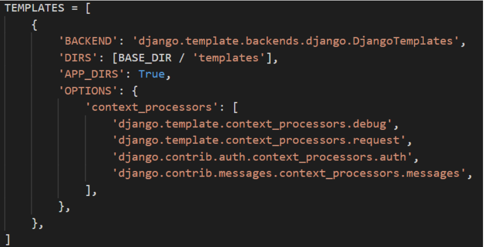

### 2.2 Project URL 설정

- Project 폴더 내의 `urls.py`에서 큰 실행할 앱의 큰 뿌리 url을 path로 만들고 그 이후의 url은 앱 내의 `urls.py`에서 정의한 url로 실행되도록 include 해준다.
- `path('articles/', include('articles.urls')),` 모든 path는 `urlpatterns`라는 리스트에 포함시켜야 한다.
- 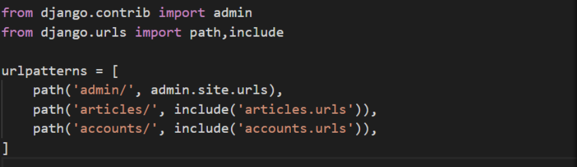

### 2.3 App URL 설정

- articles app 폴더 내부에 `urls.py`파일을 생성하고, 앱에서 데이터 생성/조회/수정/삭제를 구현할 url 경로들을 선언한다.
- 다른 앱에서나 동일한 앱에 있는 url 경로들을 쉽게 이동시킬 수 있도록 app_name을 만들고, 선언할 path에도 name을 작성해준다.
- 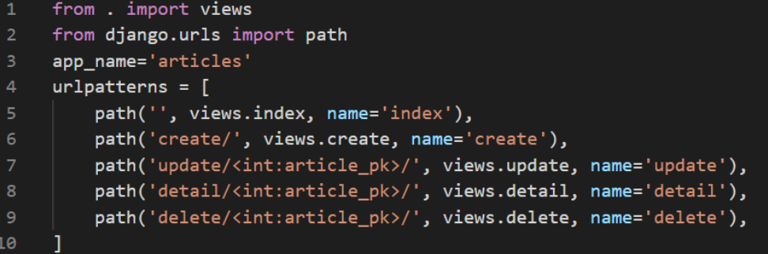

## 3. Model & ModelForm설계

### 3.1 Model 설계

> Database에 저장될 Data의 틀을 만들어주기 위함이다.

- 게시판 기능을 구현할 것이기 때문에 제목, 내용, 생성날짜, 수정날짜를 데이터 필드로 갖는 class를 생성한다.

- 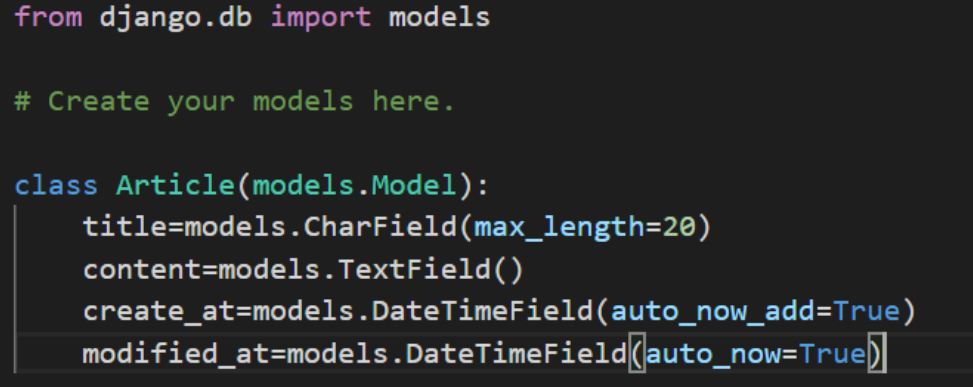

### 3.2 ModelForm 설계

> Data를 쉽게 관리하게 위해 django에서 지원하는 ModelForm을 사용한다.

- App 폴더 내부에 `forms.py`를 생성한다.
- `ArticleForm`이라는 클래스를 만들고 `forms.ModelForm`을 상속받도록 하여 django에서 지원하는 ModelForm을 사용하도록 한다.

- `AriticleForm` 클래스 내부에는 Meta Data를 설정한다.

- 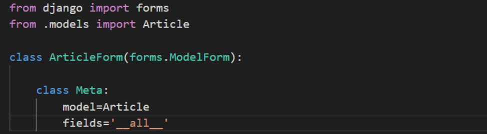

### 3.3 Migrate

> 설계한 model을 db에 등록시켜주기 위함이다.

- `python manage.py makemigrations`의 명령어를 통해 db에 등록시킬 준비를 한다.
- `python manage.py migrate`의 명령어를 통해 db에 등록시킨다.
- model이나 modelform을 변경했을 때는 위의 두 명령어를 다시 실행해야한다.

- 정상적으로 DB에 등록됐으면 프로젝트 폴더에 `db.sqlite3`가 생성됨을 확인할 수 있다.

## 4. View 함수 설계

> Model과 Template을 연결해주는 다리 역할을 하며, view함수에서 원하는 페이지를 rendering/redirecting 할 수 있고, 요청받은 데이터를 저장/수정/삭제 할 수 있다.

### 4.1 index 함수

- 게시판의 기본 페이지이며 저장되어 있는 모든 게시글들을 보여주도록 db에 저장되어 있는 모든 게시글을 보내주는 함수이다.

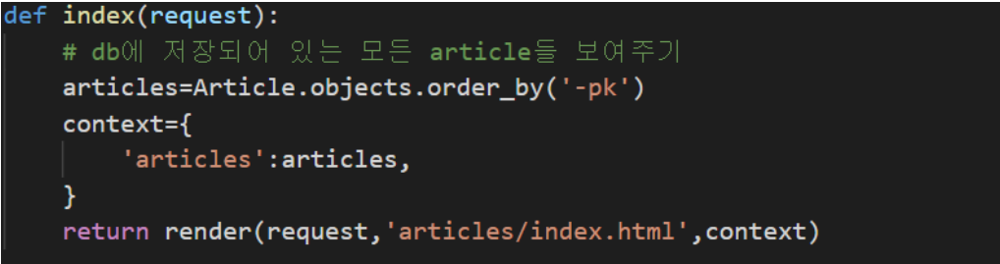

### 4.2 create 함수

- method에 따라 게시글 생성 페이지를 보여주거나, 게시글 생성 페이지로부터 입력받은 데이터를 db에 등록시키도록 한다.

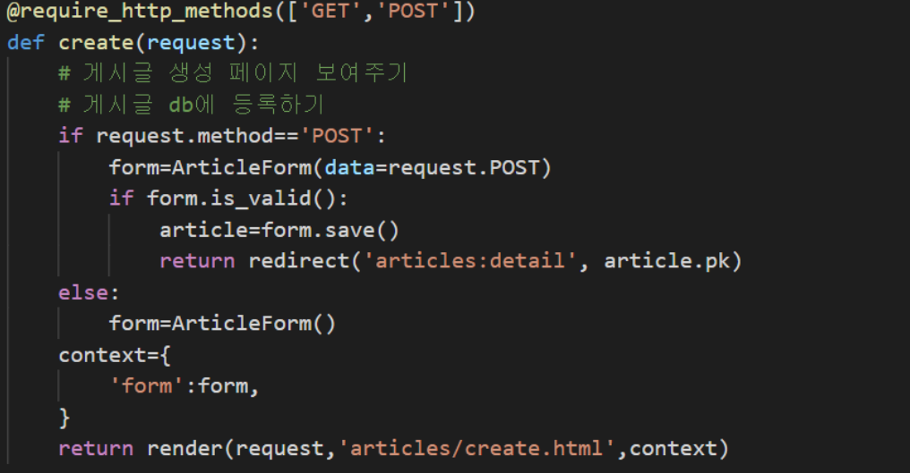

### 4.3 detail 함수

- 게시글의 제목,내용,생성날짜,수정날짜 등 상세 항목들을 모두 보여주도록 특정 게시글의 데이터를 보내주는 함수이다.

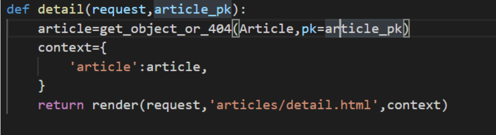

### 4.4 update 함수

- 게시한 글을 수정하도록 하는 함수이다. 사용자에게 보여주는 폼은 create 페이지에서 보여주는 폼과 동일하나, db에서 데이터를 받아와 해당 폼에 데이터를 담아놓고 수정할 수 있도록 한다.

### 4.5 delete 함수

- 특정 게시글을 DB에서 삭제하는 함수이다. 삭제 후에는 기본 페이지인 index 페이지를 열도록 한다.

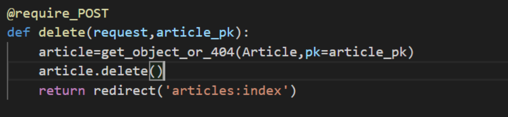

## 5. Templates

> View함수를 통해서 설계한 Model(Data)를 받아 사용자들에게 웹 페이지를 통해 보여주도록 하는 html 파일들이 담긴 폴더이다.

### 5.1 index.html

- Views.py의 index함수에서 index.html을 rendering할 때 dictionary 타입에 모든 article 객체를 담아 보내준다. index.html에서 `article`키 값을 사용해 html 페이지에 게시글을 보여준다.

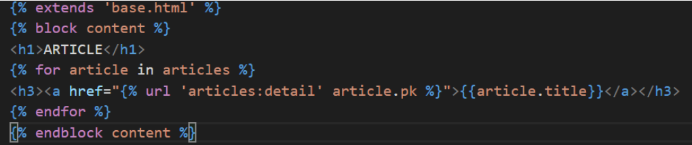

### 5.2 create.html

- Views.py의 create함수에서 게시글 생성 폼을 데이터로 받아 create.html에서 게시글을 생성할 수 있는 폼을 보여주도록 한다. 게시글을 DB에 등록할 때에는 DB에 변화가 생기기 때문에 `POST` 방식을 사용하여 데이터를 서버에 보내준다. update 또한 같은 html을 사용하지만 update 함수에서 수정할 게시글의 인스턴스를 담아 create.html을 실행하기 때문에 이미 작성한 데이터가 그대로 보여진다. 

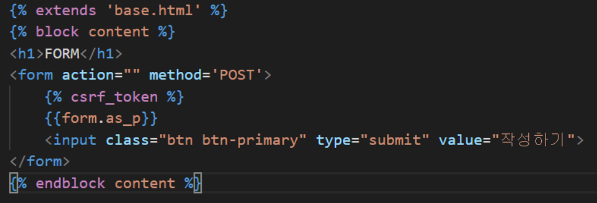

### 5.3 detail.html

- Views.py의 detail함수에서 특정 게시글 정보를 데이터로 받아 detail.html에서 게시글 상세정보를 보여주도록 한다.  index 페이지로 갈 수 있도록 하는 링크와 게시글을 수정할 수 있도록 하는 링크를 같이 보여준다. 또한, 해당 게시글을 삭제할 수 있는 버튼을 보여주고, 이는 POST 방식을 사용하여 DB에서 해당 게시글을 삭제한다.

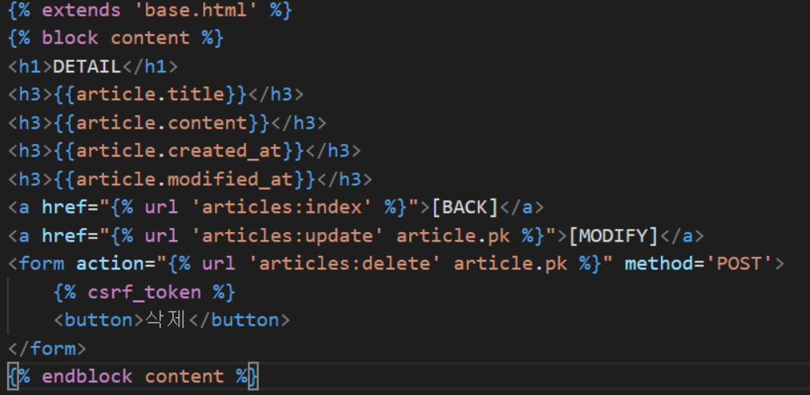

