[TOC]

# Django auth

> 2020.09.27


## 1. Accounts

> 계정을 만드는 앱을 분리해서 만든다. 앱 이름을 `accounts`로 하는 이유는 `auth`와 관련된 기본 설정들이 accounts로 적용되고 있기 때문에 편의상 `accounts`로 해준다.


### 1.1 accounts 앱 생성

- 회원 기능을 구현할 `accounts` 앱을 생성한다.

```bash
$ python manage.py startapp accounts
```

- 프로젝트에 앱을 등록시켜주기 위해 `settings.py`의 `INSTALLED_APPS`에 `accounts`를 추가한다.

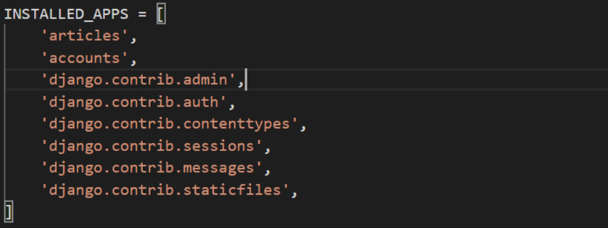

- `accounts` 앱과 관련된 url을 프로젝트 `urls.py`에 등록시킨다.

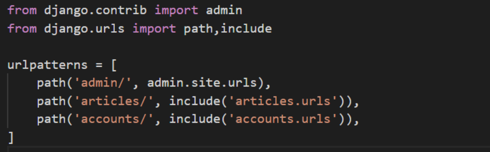


## 2. model & form

> django는 기본적으로 인증에 관련된 `built-in form`을 제공한다. django에서 제공하는 user모델이 있으며, 이를 쉽게 저장하고 보여줄 수 있도록 하는 `UserCreationForm()`, `AuthenticationForm()`,`UserChangeForm()` 내장 폼이 있다.
>
> 즉, Django 프로젝트에서 user와 관련한 모델은 따로 설계하지 않아도 되며, `view`에서 계정계정 생성/수정 등의 폼을 `template`으로 보내주고 `template`으로부터 받아 사용하면 된다.
>
> bulit-in-form`을 사용하되 우리가 원하는 정보만을 보여주기 위해서 form을 상속받아 overriding 할 수 있다. 


### 2.1 User 대체 model

> django 프로젝트에서는 기본적으로 제공하는 user 모델이 있기 때문에 따로 user 모델을 생성하지 않아도 계정을 구현할 수 있다. 이 때 `AUTH_USER_MODEL`의 default 값은 `auth.user`이다. 하지만, 나중에 user 모델을 변경할 상황이 오면 변경하기 매우 어려워진다. 그래서 일단 부가 기능이 필요없다고 하더라도 대체하는 user 클래스를 만들어주는 것이 좋다.

- 대체할 `User`모델은 `AbstractUser`를 상속받는다. `AbstractUser`내부의 필드에는 아이디, 비밀번호,이메일 등등 다양한 필드들이 존재한다. `AbstractUser`는 관리자 권한과 함께 완전한 유저모델을 구현하는 기본 클래스이다.
- `AbstractUser`는 `AbstractBaseUser`를 상속받는다. `AbstractBaseUser`내부의 필드에는 비밀번호와 마지막 로그인 시간만을 필드로 갖는다.


### 2.2 User class 생성

- 우선 프로젝트에서 따로 추가하거나 변경해줘야 하는 필드들이 없기 때문에 대체 클래스를 생성해주고 `pass`로 마무리한다.

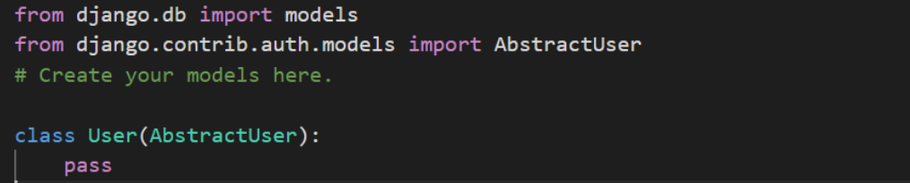


### 2.3 AUTH_USER_MODEL in settings.py

> Django에서 제공하는 User Model을 사용하면 `AUTH_USER_MODEL=auth.user`로 정해져 있다. 하지만 대체 user class를 사용하려면 이 값을 변경해주어야 한다.

- 프로젝트 폴더 내의 `settings.py`에서 `AUTH_USER_MODEL='app_name.model_name`으로 변경해준다.

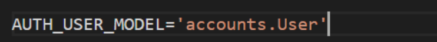


### 2.4 CustomUserCreationForm

> Django에서 제공하는 UserCreationForm()에서 원하는 필드들만 보고 싶을 경우 UserCreationForm을 상속받아 필드를 재정의한다.

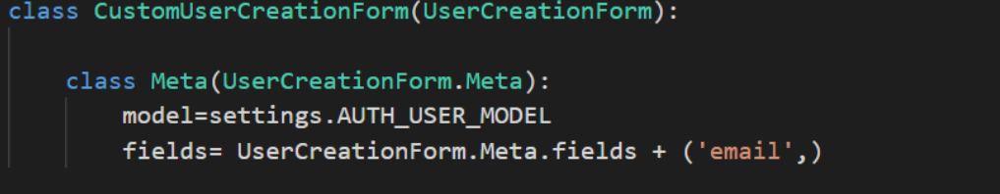


### 2.5 CustomUserChangeForm

> CustomUserCreationForm과 같이 원하는 필드들만 보여주기 위해 재정의한다.

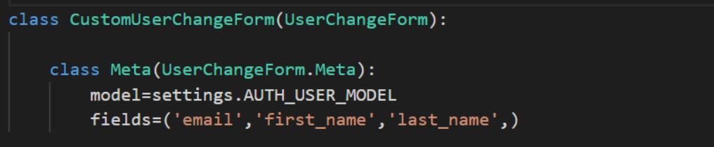


## 3. urls.py in accounts

- accounts 앱에서 구현할 기능들을 실행할 url들을 accounts 앱 내의 urls.py에 선언한다.

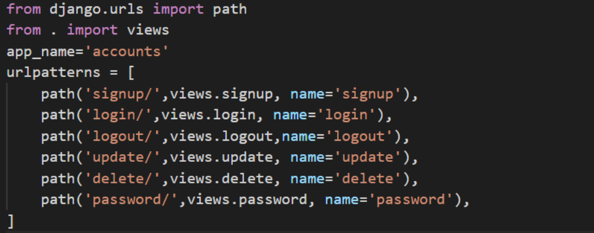


## 4. Views.py in accounts

> accounts에서 구현할 signup, login, logout, update, delete, passwordchange 함수를 정의한다.

### 4.1 signup 함수

> 회원가입 기능을 하는 함수로 signup 페이지로 이동시키거나, 사용자로부터 입력받은 정보로 하여금 계정을 생성한다.

- `request.method=='POST'`일 때는 계정을 생성하여 db에 등록시키고, `request.method=='GET'`일 때는 계정을 생성하는 페이지를 rendering한다.

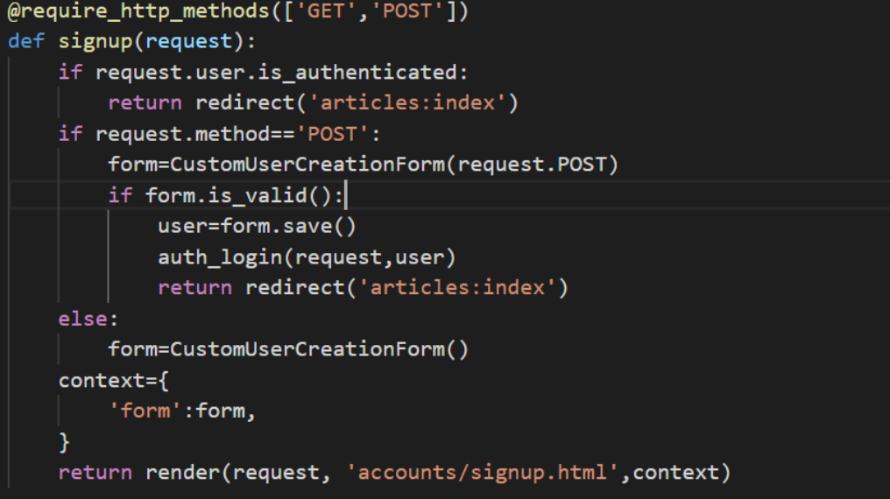


### 4.2 login 함수

> 로그인 기능을 하는 함수로 로그인을 할 수 있는 페이지로 이동시키거나, 사용자로부터 입력받은 정보로 하여금 계정을 서버에 로그인시킨다.

- `request.method=='POST'`일 때는 계정을 서버에 로그인 시키고, `request.method=='GET'`일 때는 로그인 할 수 있는 페이지를 rendering한다.

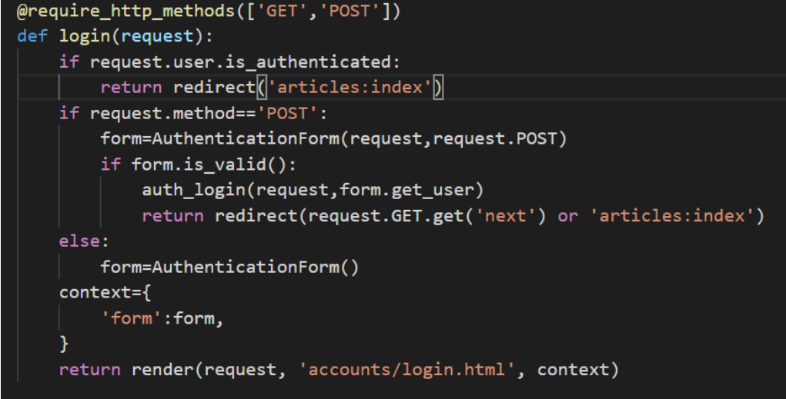

- 로그인 할 때는 받아온 정보를 담고 있는 form의 get_user 메서드를 사용하여 user 모델을 불러온다.


### 4.3 logout 함수

> 로그아웃 기능을 하는 함수로 로그아웃 버튼을 눌렀을 때 서버에서 로그아웃 시키고 index페이지로 넘겨준다. 

- db 내의 생성되어 있는 `session_id`를 지워주는 과정이기 때문에 `POST`방식만을 사용해야한다.

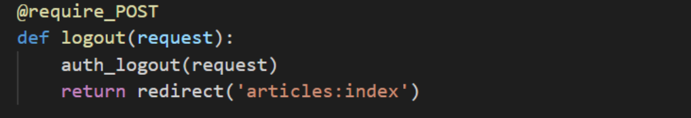


### 4.4 update 함수

> 로그인 된 상태에서만 접근할 수 있어야 하며, 로그인 되어있는 계정의 정보를 수정할 수 있는 페이지를 불러오거나, 수정된 정보들로 하여금 계정 정보를 수정하여 db에 새로이 저장한다.

- `request.method=='POST'`일 때는 수정된 정보를 db에 재등록하고, `request.method=='GET'`일 때는 계정을 수정할 수 있도록 수정 페이지를 rendering한다.

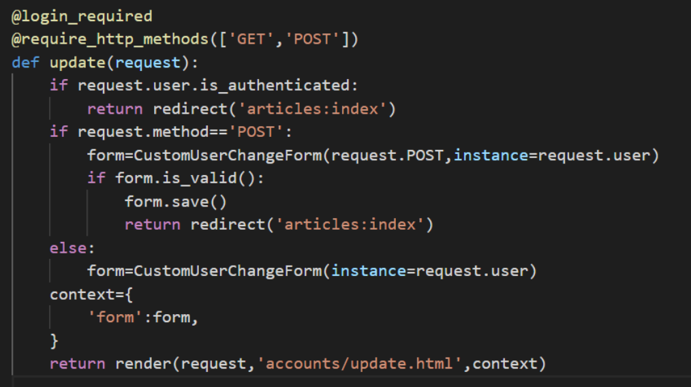


### 4.5 delete 함수

> db에 등록된 계정을 삭제하는 함수이다. db를 변경하는 과정이기 때문에 `POST`방식이어야만 하고, 로그인이 되어있어야 한다.

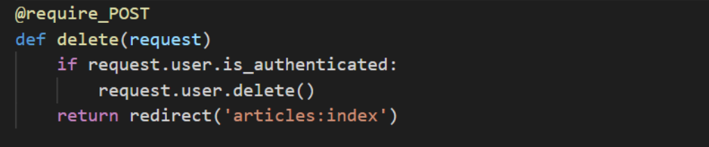


### 4.6 change_password 함수

> 비밀번호를 변경하는 함수이다. 

- `request.method=='POST'`일 때는 바뀐 비밀번호를 새로이 db에 저장하도록 하고, `request.method=='GET'`일 때는 비밀번호를 바꿀 수 있는 `form`을 보여주는 페이지로 이동한다.

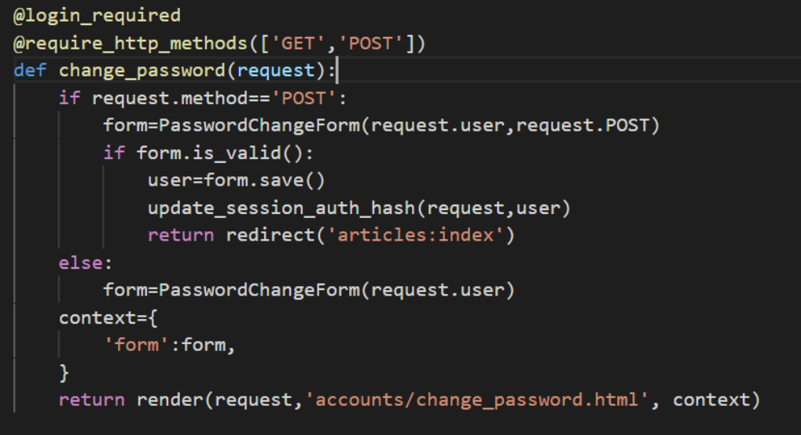


## 5. templates in accounts


### 5.1 signup.html

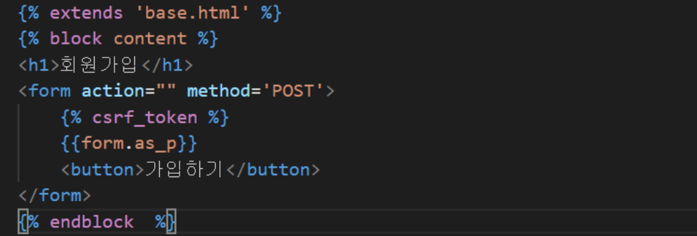


### 5.2 login.html

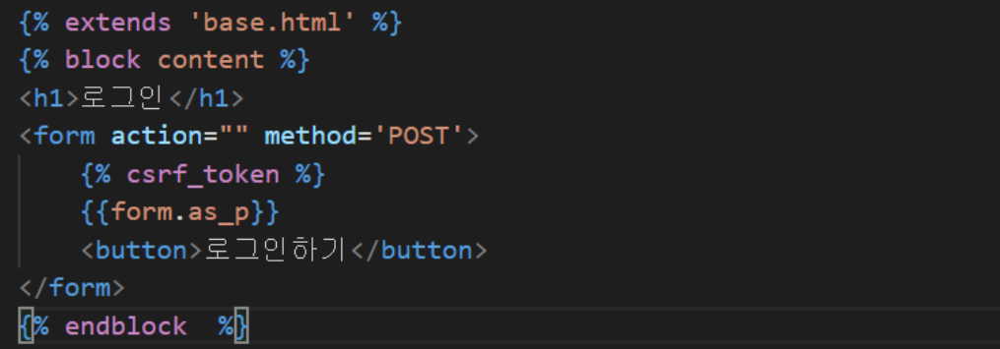


### 5.3 update.html

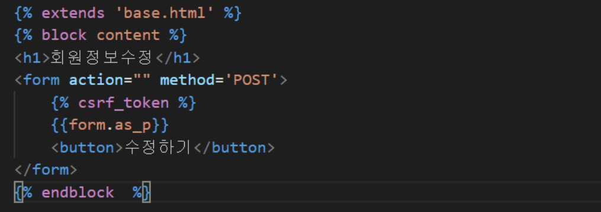


### 5.4 change_password.html

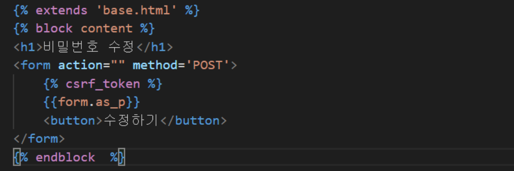

