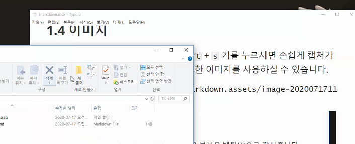

# 마크다운

> 마크다운은 개발자들의 메모장

## 1. 문법

### 1.1 Header

> 헤더는 제목을 표현할 때 사용합니다.

- h1(가장 큰 제목) 부터 h6(가장 작은 제목)까지 표현 가능합니다.
- #의 개수로 표현합니다.

### 1.2 List

> 목록을 나열할 때 사용합니다. 순서가 있거나 없는 목록을 만들 수 있습니다.

1. 순서가 있는 목록
   1. 1.을 누르고 스페이스바를 누르면 생성할 수 있습니다.
   2. `tab`키를 누르면 하위 항목을 생성할 수 있고, `shift` +`tab`을 통해 상위로 이동도 가능합니다.

- 순서가 없는 목록
  - `-` (하이픈)을 쓰고 스페이스바를 누르면 생성할 수 있습니다.
  - `tab`키를 누르면 하위 항목을 생성할 수 있고, `shift` +`tab`을 통해 상위로 이동도 가능합니다.

### 1.3 Code block

> 코드 블록은 작성한 코드를 정리하거나 강조하고 싶은 부분을 나타낼 때 사용합니다.

- Inline

  -  인라인 블럭으로 처리하고 싶은 부분을 백틱(`)으로 감싸줍니다.
  - `예시` 

- Block

  - 백틱을 세번 입력하고 `Enter`를 누르면 생성됩니다.

  - ```python
    import random
    choice = random.sample(range(1,46))
    ```

### 1.4 이미지

- 참고 : win10에서 `win`+`shift`+`s` 키를 누르면 캡쳐가 가능합니다. 붙혀넣기를 통해 캡처한 이미지를 사용할 수 있습니다.
- ``을 작성하고 `()`안에 이미지 주소를 입력합니다. `[]`안에는 이미지 파일의 이름을 작성합니다.

### 1.5 Link

> 특정 주소로 링크를 걸 때 사용합니다.

- `[]()`을 작성하고 `()`안에 링크주소를, `[]`안에 어떤 링크주소인지를 작성하면 됩니다.
- [구글](https://www.google.com)
- `Ctrl`+`좌클릭` 링크로 이동


### 1.6 Table

> 표를 작성하여 요소를 구분할 수 있습니다.

- `|`(파이프) 사이에 컬럼을 작성하고, `Enter`를 눌러줍니다.
- 마지막을 `|`(파이프)로 끝내주어야 합니다.
- `Ctrl`+`Enter` 로 행 추가가 가능합니다.

| 이름 | 성별 | 나이 |      |      |      |
| :--: | ---- | ---- | ---- | ---- | ---- |
|  ㅇ  | ㅇ   |      |      |      |      |

